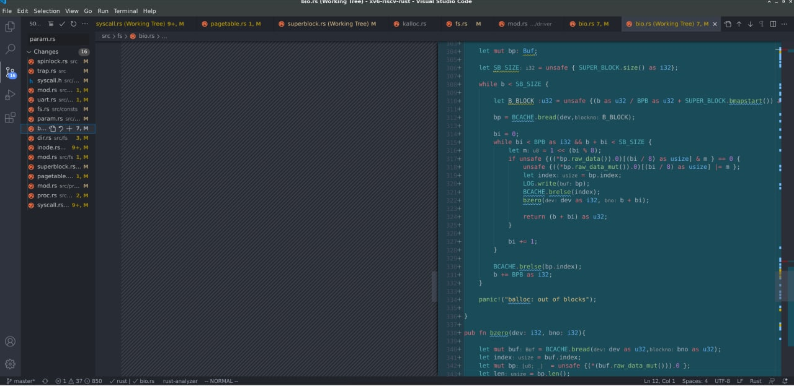

# Instruction Document of xv6-riscv-rust-project

## Environment

### Operating System

`Linux 5.8.0-53-generic #60~20.04.1-Ubuntu`
    
### Simulator

Install the qemu

```sh
 wget https://download.qemu.org/qemu-4.1.0.tar.xz  # Download qemu
 ./configure                                       # configure it
 make -j4
 make install # install
 ```

### Rust tool chain

```sh
curl --proto '=https' --tlsv1.2 -sSf https://sh.rustup.rs | sh   # download rust development tool (compiler, cargo, rustup, ...)
source ~/.bashrc
cd ./72-code/xv6-riscv-rust
rustup target add riscv64gc-unknown-none-elf                     # add cross-compiler
cargo run # build the project.
```

## How to run?

``` sh
cd ./72-code/xv6-riscv-rust
cargo run   # Compile and run the project on qemu.
```

After running successfully, you can type, but you can only enter 128 characters at most. Currently pressing the back key does not delete characters, only spaces are output.

Modify `a7` of the `jsyscall()` function in the `jsrc/process/proc.rs` file:
Change it to **1** to test the `sys_fork()`. At present, the fork will always run, spawning 63 child processes.
Changed to **5**, currently read is not implemented (because the original project is too incomplete and the console cannot enter any characters, the console input must be implemented before sys_read can be implemented, so we have implemented the console input).
Change to **7** can test `sys_exec()`, but it has not been fully realized at present, only the step of path to inode has been realized, and the second step of loading the elf file into the memory has not been realized (this is because the elf file needs the support of the file system, but the original project is too Incomplete, the file system is not complete, so we try to repair and complete the file system)

This file retains git and has no commit, so you can open it with **vscode**, download the git plug-in, select the third source code management from top to bottom in the left column, you can see all the code change records, and do it with the source file Compared.

An example of git comparison files is as follows:
