# 72-Report xv6 riscv-Rust

## Result analysis:

Our expected goal is to implement three system calls and a shell:

We were going to implement two system call `fork`, `exec`. We were also expecting to implement a `echo` program and a `shell` program.

Eventually we have completed four kernel functions, `sys_fork` , `sys_exec` that is related to system call. We partially implement the `file system` and `console`, since `file system` and `console` are necessary for `shell` and `echo` and `system call`.

`sys_fork` and `Console` have been achieved.

`sys_exec` and `echo` are mostly finished (need improvement and bugs repair)

Due to the serious lack of functions in the whole project, we need to make up a lot of unexpected code.

### 1. sys_fork
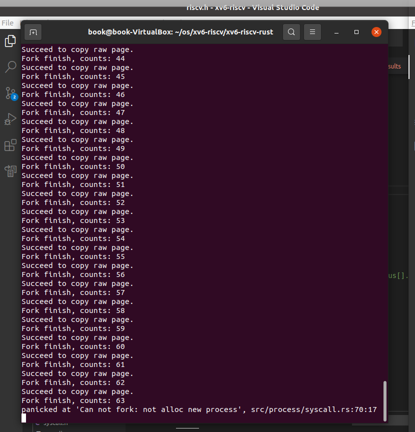

Because we haven't implemented the complete sys_exec and file system, we can't enter the user mode.

So we test `sys_fork` separately in kernel mode, and the program run fork until it can no longer allocate a new processes.

The maximum number of processes in xv6 is 64, and the initialization process is called "0", so we can fork 63 processes.

### 2. Console Read(shell need it)
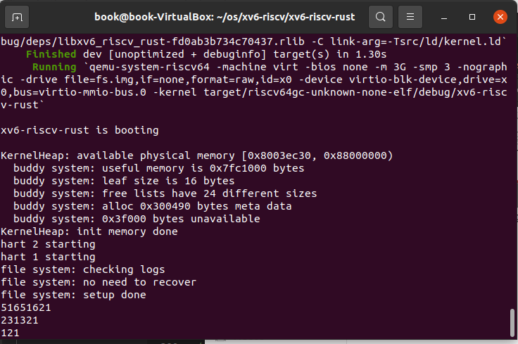
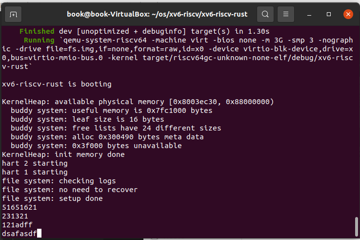

Because in the original project, users can't input characters in the console.

The implementation `shell` must interact with the user, so we need to implement the input of the console.

The maximum size of input buffer of console is 128, and the input of 128 characters is supported at one time.

### 3. sys_exec

It is divided into two parts. One is to use path to find inode, one is to load elf file.

At present, we complete the first part: finding the inode of the file by using path.

Since the later part needs the support of file system, we need to repair the file system.

### 4. File System(shell and sys_exec need it)

We didn't expect to complement the file system at first, however, system call such as `exec()` is strongly based on file system, so we have to finish it.

The file system of xv6 consists of 7 layer, including file descriptors, recursive lookup , directory and inodes, block allocator, logging, buffer cache and hardware disk. The project `xv6-riscv-rust` doesn't finish the whole file system. In fact it only completes the logging layer and partially migrate some functions on `xv6` in buffer layer to rust. 

Our project finished buffer cache, block allocator and inodes of this file system.

## Implementation:

### 1. sys_fork

Preparation steps: `sys_fork` is a function in the `Proc.systemcall` structure. If it want to be called in user mode, we need to define its macro as Sys_fork = 1.

First step: We need to allocate a new process "A" from `PROC_MANAGER`. `PROC_MANAGER` will give a pid, procstate, pagetable, context and so on. In the allocation process, we need to lock to avoid asynchronous competition for "A".

Second step, UVM Copy: Given a parent process's page table, copy its memory into a child's page table. Copies both the page table and the physical memory. So we need to find physical memory by using virtual address and pagetable.

Final step: We will give "A" some parameters different from the original process such as: pid, cwd, refernce counts and so on. At the same time, do not forget to lock when modifying the parameters in the "A" process.

Fork code:

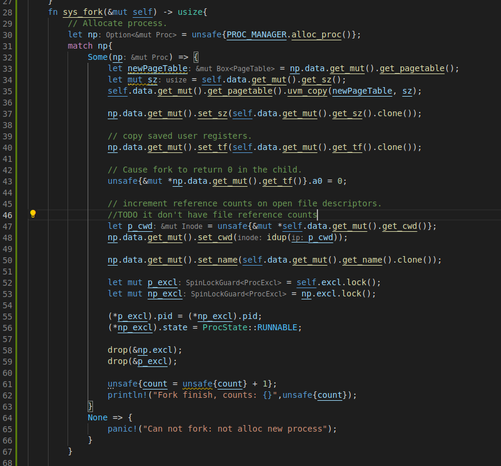

UVM Copy code:

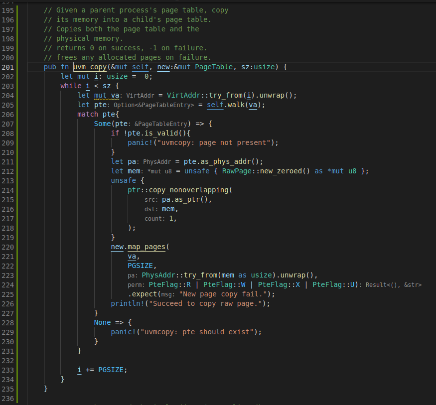

### 2. Console Read

Background: Because we want to implement the shell, users must be able to communicate with the program through the console. But in the original project, the console can't let users input, so we need to implement an interactive function to make user can input through the console.

First step: First we need to understand what happens to the program after the user enters some letters into the console. The answer is that the program will be interrupted by `UART`. Therefore, we need to add our console processing code to the `UART` interrupt processing code.

Second step: When we enter the console code, we need to get data from register LSR to determine whether it is a write operation. Then we get the data of type U8 from register RHR and print it out to let the user know that it is input correctly. All input characters are stored in the console buffer with a maximum size of 128.

Final step: Then we need to transfer all the characters in the console buffer to the user mode read buffer. In this way, the user-mode code and users can read the input from the kernel.

Interrupt handle code:

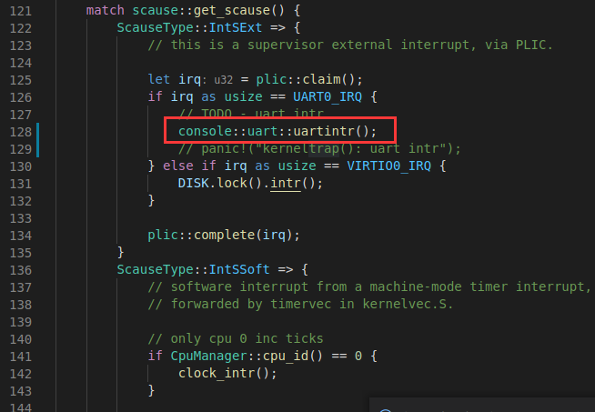

Get data from register code:

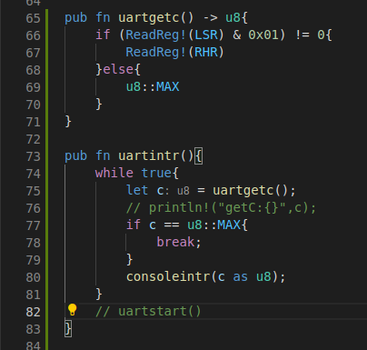

Handle input data in console code:

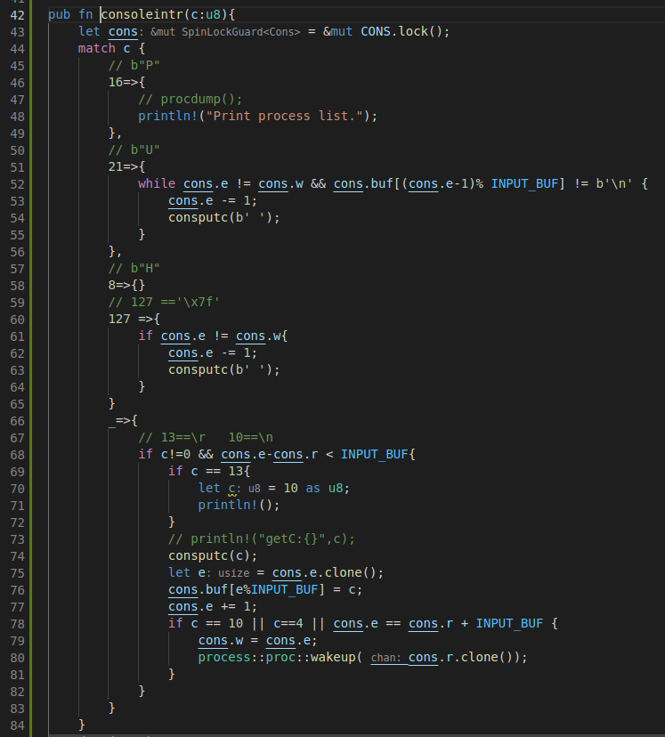

### 3. sys_exec

Background: Any program stored in user mode must be started through `exec`. But the essence of `exec` is to run a compiled executable file. In RISC V, it is an ELF file. Therefore, the first need to have a file system to store files, and the second is to load the elf file into memory.

First step: First, we get a path, we need to get his file inode through the path. Then load the ELF file in the storage space corresponding to inode.

Second step: But `exec` needs to use the file system, but the file system implementation in the original project is not complete, there are many things we need to add. So we're going to improve the file system.

Get inode from path code(Incomplete, file system required):

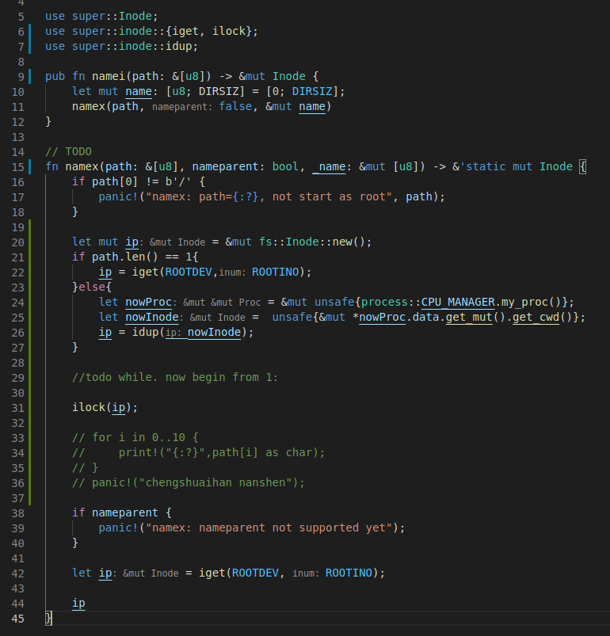

### 4. File System
In the beginning, we didn't have a deep understanding of the architecture of the operating system, so we don't think we need to complete a file system. Later, we learned that many important functions must be based on the file system, so we set out to develop it.

The xv6-riscv project does not have a complete implementation of the file system. It only implements the read and write drive to the disk, as well as the partially completed Inode and Buf. We first completed the allocator of Buf, and then completed some functions of Inode to read and write Buf. Finally, I tried to realize the reading and writing of Inode (that is, to the file), but it was not completed.

#### Block Allocator

>The contents of files and directories are stored in disk blocks, and disk blocks are allocated from a free block pool. The xv6 block allocator contains a bitmap of free blocks on the disk, and each block occupies one bit. The bits of the boot area, super block, i-node block and bitmap block are always set to be valid.

>The block allocator provides two functions: balloc allocates a new disk block, and bfree releases a block.

+ Allocate a block to a inode by `balloc(dev: u32)`
  + balloc() first calls readsb to read the super block from the disk (or from the block buffer) to sb. Balloc will calculate the position of the bitmap block. The calculation method is to calculate how many blocks are occupied by the boot area, super block and i-node block (using BBLOCK, which has been simplified into a calculation expression in our project). The loop starts from the 0th block until SB_SIZE (the total number of file system blocks), looking for a block whose bit is 0 in the bitmap. In order to improve efficiency, this loop is divided into two parts. The outer loop reads each block of the bitmap. The inner loop checks all BPB bits in this block. Two processes may apply for free blocks at the same time, which may cause competition, but in fact the block buffer only allows one process to use only one block at the same time.
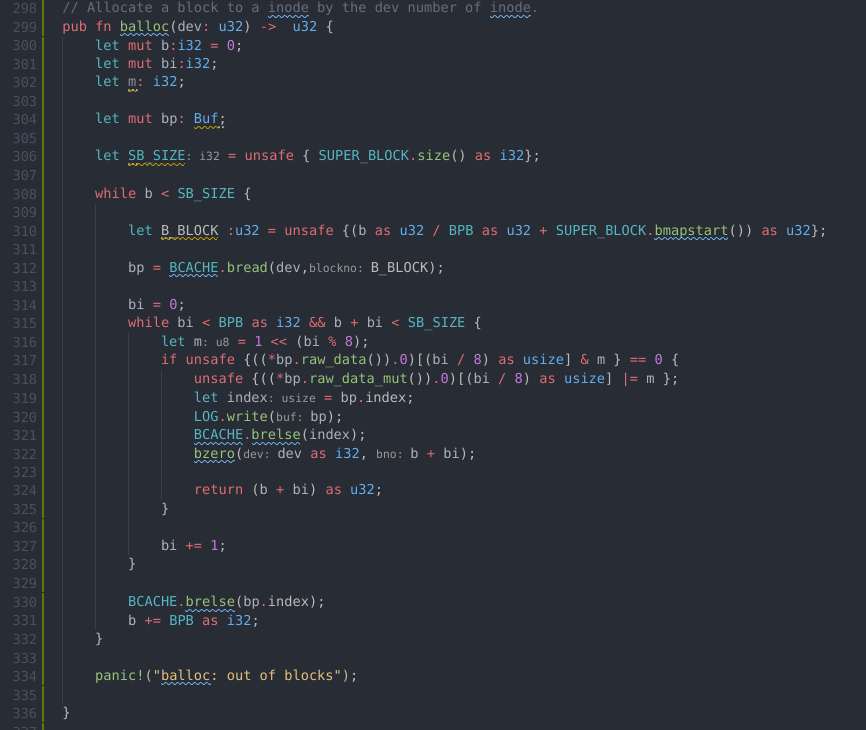

+ Set the value in block to zero by `bzero(dev:i32, bno: i32)`

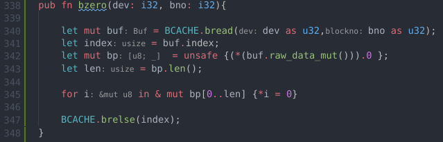

+ Free a block of inode by `bfree(dev:i32, b:u32)`
  + After bfree finds a free block, it will clear the corresponding bit in the bitmap. Similarly, the mutually exclusive use of bread and brelse blocks eliminates the need for special locks.
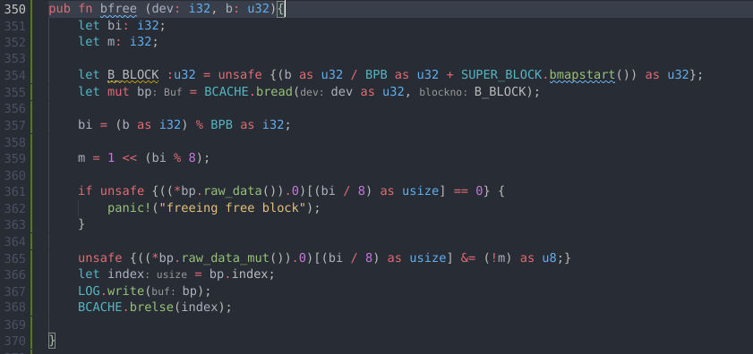

+ `bmap(ip: &mut Inode, bn:u32) -> u32` will make function of `Inode` module more easy.

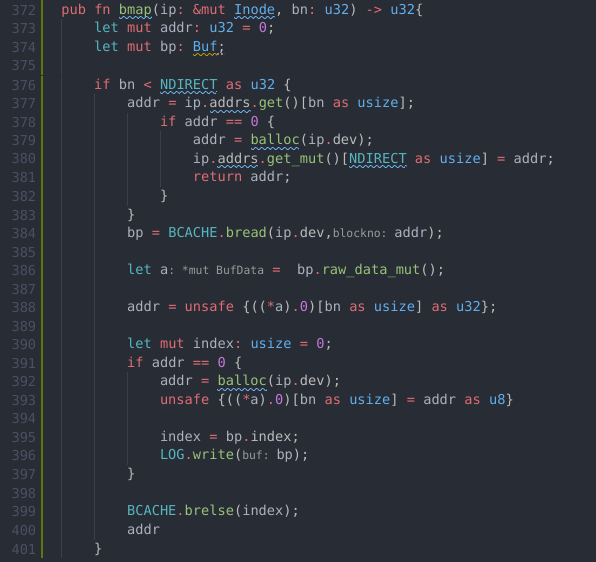

#### Buffer layer
+ `superblock.rs/bmapstart(&self) -> u32` will return the block object of the start block of super block.
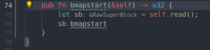

#### Inode layer

+ `readi()`(partially finished) will read the data from a Inode, it is used by `sys_exec()`.

#### Dir layer

+ `namex()`(partially finished) will get the directory address in file system of an inode.

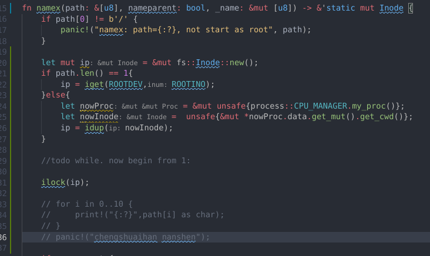

## Future direction:

Our project is still in an unfinished state. We are eager to implement an interactive operating system user program (such as a shell) and implement a relatively complete file system for display.

In fact, we still have a certain distance to achieve this goal. So we envision that in the future we can continue to work on this project. The primary goal is to complete the complete file system, and then complete the complete `exec` system call, although this requires the cooperation of many user mode and kernel mode, as well as functions for operating memory and loading elf files. We also need to complete these functional functions. After that, we can implement a simple interactive shell based on `fork` and `exec`. On these basis, we hope to be able to complete the basic user mode `ls` program and `echo` program.

## Summary:

In this project, we experienced a lot of difficult time.

We don't know anything about the rust language, so it took a lot of time to understand the characteristics of this language. We learned a lot of rust, about memory safety, life cycle, variable variability, memory layout, borrowing and referencing, and so on. The rust language has many properties that are different from the traditional C language. These properties limit us to manipulate memory as we wish, but give us higher security.

Subsequently, we also spent a lot of time to understand the system architecture of the xv6 operating system. About its virtual memory, system calls, startup process, file system, interaction between user mode and kernel mode, etc. Reading the source code of the operating system is a challenging task for us.

After understanding xv6, we started to synchronize the existing work content of the rust/xv6 project. This project has completed a series of work, but there is still a long way to go before a complete operating system. It is difficult for us to read through the logic in the rust project and understand the difference between it and the c language project. Many common practices in C can not be copied to rust, we must learn brand new methods in a limited time.

Subsequently, we began to add code to this project to complete the goals we envisioned. No one among us is good at writing rust code, or even wrote it. Therefore, initially, it was very difficult for us to add and modify the code. Then we gradually became familiar with the road, and accelerated the development efficiency.

All in all, this project allowed us to learn a lot of new knowledge. We have improved our understanding of the underlying implementation of the operating system and understood the true face of the content on the courseware when it is embodied in the code. We also learned a new programming language, although the process is a bit steep.

## Division of labor:

+ Dingqiang Ye worked on console, `sys_exec()` and `sys_fork()`.
+ Shuaihan Cheng worked on file system.